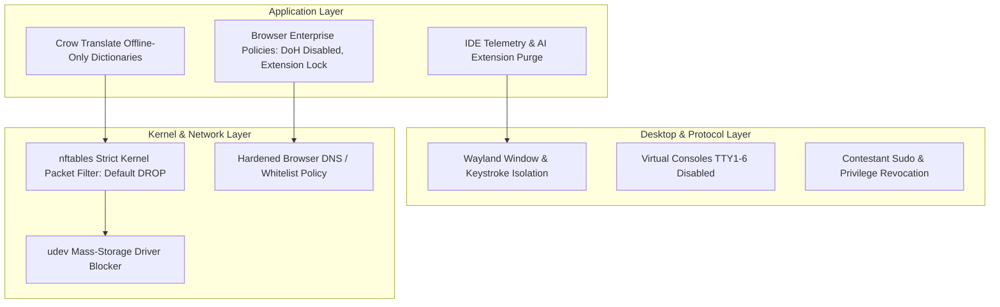

# GallosOS Network Lockdown & Security Hardening Specification

This document details the multi-layered security architecture, network whitelist enforcement, peripheral locking, and integrity controls specified for **GallosOS**.

---

## 1. Threat Model & Integrity Goals

In modern competitive programming (ICPC, IOI, local tournaments), unauthorized access to Generative AI coding assistants, remote problem solvers, or hidden code storage completely undermines contest integrity.

### Primary Threat Vectors

1. **Cloud AI & LLM Endpoints:** OpenAI API, Anthropic Claude, Google Gemini, GitHub Copilot, Cursor backend, Perplexity, HuggingFace Inference.
2. **IDE AI Plugins & Telemetry:** Pre-installed Copilot / Supermaven / JetBrains AI Assistant communicating via hidden sockets.
3. **Evasion Tunnels:** DNS-over-HTTPS (DoH), DNS-over-TLS (DoT), WireGuard, OpenVPN, SSH port-forwarding, Tor bridges, SOCKS5 proxies.
4. **Unauthorized Mass Storage:** USB flash drives containing pre-written templates or algorithm libraries plugged in during contest hours.
5. **Session Leakage:** Snooping on other workstation windows via legacy X11 protocol vulnerabilities.
6. **Low-Level Sandbox Evasion & Syscall Manipulation:** Execution of direct kernel system calls (`syscall` / inline assembly `__asm__` blocks) or compiler/kernel exploits to escape local sandboxes, access forbidden directories, or tamper with background monitoring agents.

> [!NOTE]
> **Integrity by Architecture:** GallosOS does not rely on heuristic deep-packet inspection or speculative "AI-detector" algorithms. Anti-AI protection is the deterministic consequence of strict Zero-Trust system design: a kernel-level `nftables` Default-DROP firewall allowing strictly the verified contest judge, combined with startup scripts that physically purge IDE AI plugins (`com.intellij.ml.llm`, Copilot) and strip cloud telemetry endpoints.

---

## 2. Multi-Layered Zero-Trust Architecture



---

## 3. Network Isolation & Firewall Architecture

The GallosOS specification mandates a **Strict Default-DROP** policy for all outbound packet traffic generated by the contestant.

### 3.1 Kernel Packet Filter (`nftables`)

```nftables
#!/usr/sbin/nft -f

table inet gallos_filter {
    set allowed_judge_ips {
        type ipv4_addr
        flags interval
        elements = { 10.0.0.0/8, 172.16.0.0/12, 192.168.0.0/16 }
    }

    chain output {
        type filter hook output priority 0; policy drop;

        # 1. Allow Loopback (Required for IDE local debuggers and local doc servers)
        oif "lo" accept

        # 2. Allow Established / Related connections
        ct state established,related accept

        # 3. Allow Local DNS (Port 53 UDP/TCP) to verified local gateway (dynamically populated by gallos-daemon)
        udp dport 53 ip daddr 192.168.1.1 accept
        tcp dport 53 ip daddr 192.168.1.1 accept

        # 4. Allow NTP Time Synchronization (Port 123)
        udp dport 123 accept

        # 5. Allow HTTP/HTTPS exclusively to Whitelisted Judge IPs
        tcp dport { 80, 443 } ip daddr @allowed_judge_ips accept

        # 6. Reject everything else with immediate ICMP port unreachable
        reject
    }

    chain input {
        type filter hook input priority 0; policy drop;
        iif "lo" accept
        ct state established,related accept
    }
}
```

### 3.2 DNS-over-HTTPS (DoH) & Tunnel Mitigation

- **DoH / DoT Blocking:** All traffic on ports `853` (DoT) and port `443` directed to public DoH servers (`1.1.1.1`, `8.8.8.8`, `9.9.9.9`) is dropped at the packet filter level.
- **Enterprise Browser Lockdown:** `/etc/firefox/policies/policies.json` and `/etc/chromium/policies/managed/default.json` enforce:
  - `"DNSOverHTTPS": { "Enabled": false, "Locked": true }`
  - `"DisableTelemetry": true`
  - `"ExtensionInstallBlocklist": ["*"]` (Only Competitive Companion pre-installed).

---

## 4. IDE Hardening & Licensing Strategy

### 4.1 VSCodium (Default Open Source IDE) & C/C++ Extension Strategy

1. **Telemetry-Free Binary & Clean Licensing:** VSCodium is a community-driven MIT build of Code-OSS without Microsoft proprietary telemetry keys, freely redistributable inside our SquashFS images, and connected to the Open VSX marketplace.
2. **Open-Source C/C++ Toolchain (`clangd` + `webfreak.debug`):**
   - **Why NOT `ms-vscode.cpptools`:** Microsoft's official `ms-vscode.cpptools` extension contains proprietary license restrictions restricting its use strictly to official Microsoft builds. Starting in April 2025, Microsoft introduced runtime checks that detect non-official builds and actively block execution in VSCodium/Code-OSS. Attempting to bypass these checks violates Microsoft's EULA.
   - **GallosOS Solution:** Pre-installs **`llvm-vs-code-extensions.vscode-clangd`** (LLVM's official open-source language server) and **`webfreak.debug`** (Native Debug / GDB). This pairing is 100% open source, faster at C++ autocompletion, fully compliant with Open VSX, and 100% legal to redistribute.
3. **Alternative Official Microsoft VS Code Track:**
   - For organizations requiring official Microsoft VS Code and `ms-vscode.cpptools`, the containerized build script can pull the binary directly at build/boot time from `packages.microsoft.com` rather than redistributing proprietary binaries in public ISOs (avoiding Microsoft redistribution EULA violations).
   - Telemetry is unconditionally disabled in the deployed `/etc/vscodium/settings.json` or `/etc/code/settings.json`:

     ```json
     {
       "extensions.autoUpdate": false,
       "extensions.autoCheckUpdates": false,
       "extensions.showRecommendationsOnlyOnDemand": false,
       "extensions.ignoreRecommendations": true,
       "telemetry.telemetryLevel": "off"
     }
     ```

4. **Pre-Installed & Declarative Extension Control (via `gallos.toml`):**
   - **`vscode-clangd`** (LLVM Language Server for fast offline C++ autocompletion).
   - **`webfreak.debug`** (Native GDB debugger).
   - **Competitive Programmer Helper (CPH)** (Offline/Online testcase runner for training).
   - **Vim Emulation (`vscodevim.vim` / `IdeaVim`)** (Modal keybindings for VSCodium and JetBrains).

   Organizers can declaratively enable, disable, or customize extensions per mode directly in `gallos.toml`:

   ```toml
   [default.ide_extensions]
   vscodium = ["llvm-vs-code-extensions.vscode-clangd", "webfreak.debug", "cph", "vscodevim.vim"]
   jetbrains = ["IdeaVim"]

   [contest.ide_extensions]
   # In strict contest mode, CPH is omitted, leaving pure language servers & modal keybindings
   vscodium = ["llvm-vs-code-extensions.vscode-clangd", "webfreak.debug", "vscodevim.vim"]
   jetbrains = ["IdeaVim"]
   ```

   > [!TIP]
   > **Mode-Sensitive Extension Control:** Extensions like **CPH** and browser companions (**Competitive Companion**) streamline practice during `Default` and `Event` training (Codeforces, AtCoder, CSES). In strict onsite tournaments (ICPC / IOI with DOMjudge/BOCA), organizers can omit them from `[contest.ide_extensions]` to enforce strict manual testing rules.

### 4.2 JetBrains Ecosystem (Community Baseline vs. Optional Sponsored Pro Extension)

- **Default Standard (FOSS / Zero Config):** IntelliJ IDEA Community Edition & PyCharm Community Edition are the primary JetBrains baseline. They require zero license configuration, zero network activation, and are ready out of the box for university clubs and regional contests.
- **Declarative Plugins:** Essential competitive programming plugins such as **IdeaVim** are pre-bundled and activated declaratively via `gallos.toml`.
- **Optional Sponsored Pro Mode (Future Extension):**
  - For tournaments officially sponsored by JetBrains (e.g. ICPC World Finals), a modular license injection mechanism can optionally load offline ticket licenses for **CLion** and **IntelliJ Ultimate**. This is treated as a secondary, late-stage extension since Community Editions and VSCodium cover the vast majority of contest scenarios.
  - **Crucial Air-Gap Guarantee:** In all JetBrains editions, the `com.intellij.ml.llm` (JetBrains AI Assistant) plugin is unconditionally purged from `plugins/`.

---

## 5. Peripheral & USB Storage Lockdown

During **`Contest` Mode**:

- **HID Allowed:** USB keyboards, mice, and assistive devices are permitted.
- **Mass Storage Blocked:** When `allow_usb_storage = false`, a dynamic `udev` rule unbinds the `usb-storage` and `uas` kernel modules:

  ```bash
  # Block new USB mass storage devices from being exposed as block nodes
  echo 'ACTION=="add", SUBSYSTEM=="usb", ATTR{bInterfaceClass}=="08", RUN+="/bin/sh -c '\''echo 0 > /sys$DEVPATH/authorized'\''"' > /etc/udev/rules.d/99-contest-usb-block.rules
  udevadm control --reload-rules
  ```

- At the end of the contest, USB storage is re-authorized so contestants can export their code archive (`contest-YYYYMMDDTHH-MM-SS.tar.gz`).

---

## 6. Keyboard Layout Selector

Contestants come from diverse international backgrounds and require specific layout mappings:

- **Supported Layouts:** `latam` (Latin America), `us` (US English), `es` (Spain), `br` (Brazil ABNT2), `dvorak`.
- **Fast Switching:**
  - **Global Hotkey:** `Alt + Shift` cycles through active layouts.
  - **Status Bar Module:** Visual flag/text indicator in Waybar status bar.
  - **Persistence:** Layout choice is saved across app launches within the session.

---

## 7. Offline Documentation & Translation

To ensure non-native English speakers can compete fairly without internet access to Google Translate / DeepL:

1. **Bundled Offline Language Documentation (`/usr/share/doc/`):**
   - C++: Full `cppreference-doc` HTML snapshot with offline search index.
   - Java: JDK API Specification.
   - Python: Official Python 3 docs.
   - Kotlin / Rust: Language manuals.

2. **Dual-Mode Translation Engine (Offline Dictd + Whitelisted API Crow Translate):**
   - **Airtight Offline Mode (Air-Gapped & Strict Regionals):** Bundles a local `dictd` daemon (`127.0.0.1:2628`) with FreeDict bilingual databases (`eng-spa`, `eng-por`) and StarDict lexicons. Lookups run entirely over loopback with zero external network traffic, guaranteeing 100% functionality even under complete firewall lockdown.
   - **Controlled Online Translation Mode (Optional for Camps / Qualifiers):** When organizers permit online translation, they whitelist raw API endpoints (e.g. `translate.googleapis.com` or LibreTranslate) in `gallos.toml`. Because Crow Translate communicates strictly via raw translation APIs (JSON payload) rather than rendering web pages, it provides full-sentence translation **without exposing web-proxy bypass vulnerabilities** (which occur when contestants access the full `translate.google.com` web browser interface to load forbidden sites).
   - **Automatic Local Fallback:** If online translation endpoints become unreachable or network drops, translation tools fall back seamlessly to the bundled local dictionary databases.

---

## 8. Administrative Proctoring, Auditing & Fleet Telemetry

For official tournaments requiring strict proctoring (such as ICPC Regionals, IOI selection contests, and certified remote competitions), the GallosOS architecture defines an **opt-in, declarative auditing engine** managed by `gallos-daemon`:

### 8.1 Periodic Desktop Screen Auditing

- **Wayland-Safe Capture:** While unprivileged student applications cannot snoop on the screen, a privileged system service running as root/daemon captures periodic desktop frames via compositor protocols (`grim` / `wlr-screencopy`).
- **Interval & Storage:** Configurable via `gallos.toml` (e.g. every 60 seconds). Images are tagged with timestamp, team ID, and hostname, and stored in `/var/log/gallos/audit/screenshots/` or synced to the central administrative server.

### 8.2 Automated Incremental Code Backups

- **Dispute Resolution & Crash Protection:** Inspired by IOI's `ioibackup.sh`, GallosOS runs an automated background snapshot of `/home/contestant/` every 5 minutes.
- **Forensic Timeline:** Allows judges to review a timeline of source code changes in case of cheating allegations or unexpected workstation power loss.

### 8.3 Privileged Keystroke Forensics (Optional)

- **Kernel-Level Audit (`/dev/input`):** If enabled by contest administrators, hardware-level key event counters or logs are recorded by a root daemon, without exposing global key event streams to unprivileged desktop processes.

### 8.4 Fleet Telemetry & Monitoring

- **Prometheus Exporters:** Bundles lightweight `node-exporter` and `gallos-exporter` services.
- **Central Dashboard:** Transmits real-time CPU load, memory utilization, network sockets, and process lists over a secure WireGuard mesh to the contest director's Grafana dashboard.

---

## 9. Mitigations for Low-Level Sandbox Evasion & Syscall Manipulation

To prevent contestants from executing malicious kernel system calls (`syscall` / inline assembly `__asm__`) or compiler-busting memory exploits to hijack the system or bypass the local sandbox, GallosOS implements four strict operating system defenses:

### 9.1 Privileged Command & Sudo Revocation

- **Strip Sudo Access:** The `contestant` user profile is stripped of all administrative rights. There is no `sudo` binary access, and `polkit` policies are configured to block privilege escalation.
- **Root Directory Lock:** Even if inline assembly executes direct system calls (`sys_open`, `sys_write`), the kernel rejects operations attempting to touch folders outside `/home/contestant/` and `/tmp/`.

### 9.2 Immutable Read-Only Root Filesystem (SquashFS + OverlayFS)

- **SquashFS Layer Integrity:** Critical OS directories (`/bin`, `/sbin`, `/lib`, `/usr`) reside inside the read-only SquashFS container.
- **Ephemeral RAM Overlays:** Any local file modifications, write attempts, or script replacements only affect the ephemeral memory OverlayFS layer in RAM. A reboot immediately purges any local modifications, preventing contestants from permanently replacing system binaries or tampering with security/audit logging services.

### 9.3 Systemd Hardening & Syscall Filtering (`seccomp-BPF`)

- **Systemd Service Sandboxing:** Background services (such as `gallos-daemon`, OOM notifier, and telemetry exporter) run under systemd hardening guidelines:
  - `NoNewPrivileges=true`: Prevents child processes from gaining more privileges than their parents.
  - `ProtectSystem=strict`: Mounts the entire OS filesystem tree as read-only to the service.
  - `SystemCallFilter=~execve` or strict whitelist restrictions: Blocks unauthorized system calls at the kernel level using `seccomp-BPF`.

### 9.4 Wayland Window & Input Isolation

- **No Global Keystroke Sniffing:** Unlike legacy X11, the Wayland compositor (`labwc`) restricts input events exclusively to the active focused application.
- **Zero Client Inter-Process Access:** Unprivileged applications cannot inject keys, capture screenshots of other client windows, or read memory of competing IDEs, rendering GUI keyloggers or screen-snooping hacks technically impossible.
