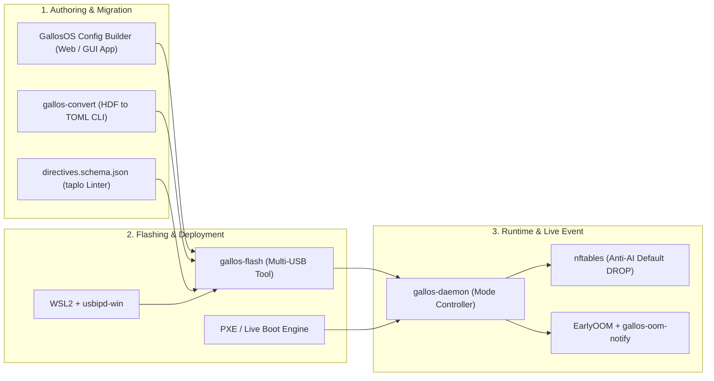

# GallosOS Configuration Specification & Directives Guide

This document defines the configuration schema, mode hierarchy, delivery methods, visual tooling, and legacy migration path for **GallosOS** contest and training profiles.

---

## 1. Versatility: Adapting to Every Competitive Programming Context

GallosOS is designed to seamlessly adapt to **any competitive programming scenario**.

> [!IMPORTANT]
> **GallosOS is always immutable on the USB.** All writes during a session live in RAM (`tmpfs`). The OS never writes to the USB drive during normal operation — this preserves USB drive longevity, ensures a pristine clean state on every boot, and prevents leftover contest data. Source code persistence is handled through **optional cloud sync** or **end-of-session USB export**, never through live USB writes.

### Context 1 — Weekly Club Sessions & Classes (Default / Event Mode)

- **Source Code Persistence:** Session work is synced to an **optional external workspace** (GitHub / GitLab / Google Drive / OneDrive / Nextcloud), configured once by the student on their account. The organizer whitelists these cloud services per the event profile.
- **Online IDEs:** Students may use browser-based IDEs (VS Code for the Web, Gitpod, Replit) if the organizer allows them — the browser is still governed by GallosOS's bookmark/whitelist policy.
- **Controlled Browsing:** Even in open club mode, the browser enforces curated bookmarks and optionally strips AI-generated response panels (e.g., blocks Google AI Overviews, Bing Copilot answers, ChatGPT).
- **Offline Tools:** Full access to compilers, VSCodium + CPH extension, and offline documentation (cppreference, Python docs, Kotlin manual) without requiring internet.

### Context 2 — Multi-Day Training Camps & Warm-Ups (Event + Contest Transitions)

- **Automated Time-Window Transitions:** $\text{Class (Event)} \to \text{Contest Simulation (Contest)} \to \text{Upsolving (Event)}$
- **Cloud Sync Between Sessions:** During Event windows between contests, students sync their upsolving notes to whitelisted cloud storage.
- **Contest Isolation:** During Contest windows, cloud sync is suspended; only the judge domain is reachable.
- **Auto-Pack on Contest End:** Contestant source code is packaged into `/home/contestant/contest-YYYYMMDDTHH-MM-SS.tar.gz` at contest close — accessible for review during the subsequent Event (upsolving) window.

### Context 3 — Official Sanctioned Tournaments (Strict Contest Mode)

- **Zero-Leak Anti-AI Kernel Firewall:** Only the designated judge domain is reachable (BOCA, DOMjudge, PC^2, Codeforces). All cloud storage, online IDEs, AI assistants, and general web access are hard-blocked.
- **USB Mass-Storage Disabled:** No external code injection via flash drives.
- **Fresh Ephemeral Scratch Space:** RAM-backed `tmpfs` — every team starts from an identical, pristine state regardless of prior usage.

---

## 2. Configuration Delivery Methods

GallosOS is designed to be **infrastructure-agnostic**: it operates across the full spectrum of network infrastructure that a venue may provide — from completely offline rooms to university-managed networks to full Venue Controller setups (see [§9 of `ARCHITECTURE.md`](./ARCHITECTURE.md#9-deployment-infrastructure-spectrum)).

### `config_url` Auto-Discovery Priority Chain

Before fetching a remote directives file, GallosOS resolves the target URL through the following chain (first match wins):

| Priority | Source | Description |
| :---: | :--- | :--- |
| **1** | GRUB boot parameter | `gallos.config_url=https://...` set at flash time via `gallos-flash`. Highest priority. |
| **2** | DHCP Option 252 | Standard DHCP lease response announces the URL. Works with any dnsmasq/ISC DHCP router — including basic lab routers — with a single config line. No GallosOS-specific server required. |
| **3** | `/etc/gallos/sync-server.conf` | Written by the GallosOS Venue Controller on first contact, or manually injected at flash time. |
| **4** | None | Boot directly from baked-in `/boot/gallos/gallos.toml` (air-gapped / standalone mode). |

### Method A: Remote Directives URL (GitHub Gist / Web Server / DHCP-Announced URL)

- Organizers host a single `gallos.toml` on a **GitHub Gist**, **GitHub Raw repository**, **university HTTP server**, or **any reachable URL**.
- The URL is delivered to contestant machines via **Priority 1 (GRUB param)** or **Priority 2 (DHCP Option 252)**:
  - **DHCP Option 252 (recommended for basic lab setups):** Add one line to the venue's existing router (dnsmasq or ISC DHCP) — no GallosOS-specific server required:

    ```text
    # dnsmasq (OpenWrt, Pi-hole, most lab routers):
    dhcp-option=252,"https://gist.githubusercontent.com/.../raw/gallos.toml"

    # ISC DHCP (dhcpd.conf):
    option wpad-url "https://gist.githubusercontent.com/.../raw/gallos.toml";
    ```

  - **GRUB boot parameter:** Set `gallos.config_url=https://...` in the USB's GRUB config at flash time via `gallos-flash --config-url`.
- **Advantage:** Organizers can update contest times, add whitelisted domains, or change wallpapers **on the fly without re-flashing or collecting USB drives**.
- **Architectural Caveat (Boot Splash):** While the desktop wallpaper and UI update instantly once the network connects, the Plymouth boot splash (`boot_splash_logo_url`) *cannot* be updated remotely because the system has no network connectivity during the first few seconds of boot. White-labeling the boot splash strictly requires Method B (Baked-In).

### Method B: Baked-In / Burn-Time Directives (Air-Gapped / Offline)

- **Default Profile:** Directives are placed directly on the USB drive during creation in `/boot/gallos/gallos.toml` or `/etc/gallos/gallos.toml`. The system automatically loads this file at boot.
- **Support for Multiple Profiles (Boot Parameter):** If an organizer wants to store multiple profiles on the same USB (e.g., `practice.toml`, `regional.toml`), they can instruct the Linux kernel via the GRUB boot menu to load a specific file using a boot parameter: `gallos.config=regional.toml`. This provides maximum flexibility for offline labs.
- **Advantage:** Requires zero internet or external server connectivity. Perfect for air-gapped rooms or offline school invitationals.

### Method C: Resilient Hybrid Fallback

- On boot, GallosOS attempts to fetch the remote URL (with a configurable 5-second timeout).
- If the remote server or network is unreachable, it automatically falls back to the **local baked-in configuration cache**, guaranteeing the machine boots into a working state under any circumstances.
- **User Notification (UX):** When a fallback occurs, the system informs the user via a Plymouth boot warning and a persistent desktop notification (e.g., *"⚠️ Offline Mode: Remote configuration unreachable. Using local baked-in profile."*) upon entering the Wayland session.

### 2.4 Architectural Separation: `gallos.toml` vs. `machine.toml` vs. `examples/`

To prevent configuration pollution and keep deployment modular, GallosOS enforces a strict separation of configuration roles:

| Configuration Entity | Purpose & Scope | Target Audience | Example Content |
| :--- | :--- | :--- | :--- |
| **`gallos.toml`** | **Global Contest Policy (WHAT & WHEN):** Identical for all 50–200 machines in the arena. Governs the rules, schedules, and security constraints of the event. | Contest Organizers & Scientific Committee | Schedule windows, `allowed_websites` (judge IPs), available IDEs, firewall rules, printing mode. |
| **`machine.toml`** | **Local Station Identity (WHO & WHERE):** Unique to each individual USB / physical PC. Defines the physical seat and assigned team metadata. | Flashing station (`gallos-flash`) / Venue Controller | `pc_name = "PC-14"`, `room = "Lab-A"`, `team_name = "Team-42"`, `seat_label = "Desk 03"`. |
| **`examples/*.toml`** | **Production-Ready Blueprints & Templates:** Pre-baked configuration recipes for popular contest platforms. | Event Organizers | `icpc-onsite.toml`, `maratona-sbc.toml`, `ioi-cms.toml`, `codeforces-training.toml`. |

> [!TIP]
> **How to use `examples/`:** Organizers do not write `gallos.toml` from scratch. For an ICPC regional, simply copy [`examples/icpc-onsite.toml`](../examples/icpc-onsite.toml) (or [`examples/maratona-sbc.toml`](../examples/maratona-sbc.toml) for South America / BOCA) to `gallos.toml` on your server or USB, adjust the competition timestamps, and deploy!

---

## 3. Format: TOML as the Sole Canonical Standard

**TOML** (`gallos.toml`) is the **sole, definitive configuration format** for GallosOS directives.

### Why TOML is the Exclusive Choice

1. **Native Datetime Literals (RFC 3339 / ISO 8601):** Timestamps like `2026-08-29T11:00:00Z` are first-class primitives in TOML, eliminating string parsing errors and timezone ambiguities.
2. **Zero Indentation Vulnerabilities:** Unlike YAML, TOML uses explicit headers (`[contest]`, `[[contest.schedule]]`) and is immune to broken indentation, tab vs. space mixups, or accidental whitespace corruption during copy-pasting.
3. **Strict Typings:** Avoids YAML's silent boolean coercion issues (e.g. `no` or `on` being misparsed as booleans).
4. **Lightweight & Secure Daemon:** Parsing TOML in Rust (`toml-rs`) requires minimal overhead, has zero unsafe dependencies, and provides memory-safe deserialization.
5. **Single Source of Truth:** One standard format across the entire ecosystem — CLI tools, Web Studio, schema validators, and the OS runtime.

---

## 4. End-to-End Ecosystem Tooling

GallosOS is designed as a complete, integrated toolkit covering every phase of contest management:



### 4.1 GallosOS Config Builder (Future Web / Desktop GUI Configurator)

To make contest preparation effortless for non-technical organizers, the design specifies **GallosOS Config Builder** (a web application and desktop GUI):

- **Visual Schedule Builder:** Interactive calendar and time-picker to define Contest, Event, and Warm-up time windows without manually typing ISO dates.
- **HuronOS `.hdf` Drag-and-Drop Importer:** One-click visual migration tool that parses legacy `.hdf` files in the browser, populates the entire UI form automatically, and exports valid `gallos.toml`.
- **Package & IDE Selector:** Checkbox catalog of available compilers (GCC, Clang, OpenJDK, Python, Rust, Kotlin) and IDEs (VSCodium, IntelliJ CE, PyCharm CE, Geany).
- **Firewall Whitelist Manager:** Preset templates for popular online judges (BOCA, DOMjudge, Codeforces, OmegaUp, AtCoder).
- **Live Validation & Export:** Instant JSON Schema validation with one-click export to `gallos.toml` or direct publishing to a GitHub Gist.

### 4.2 `gallos-convert` CLI (HuronOS `.hdf` Migration Tool)

For institutions migrating from HuronOS, the architecture includes an automated offline migration utility:

```bash
# Convert a local HuronOS directives file to native TOML
gallos-convert icpc-gpm-2026-3rd-date.hdf gallos.toml

# Convert and validate directly from a remote directives URL (e.g. CPC-GALLOS ICPC GPM)
gallos-convert https://raw.githubusercontent.com/CPC-GALLOS/icpc-gpm-uaa-huronos/refs/heads/main/icpc-gpm-2026-3rd-date.hdf gallos.toml --validate

# Preview differences between legacy .hdf and generated TOML
gallos-convert icpc-gpm-2026-3rd-date.hdf gallos.toml --diff
```

---

## 5. Schema Validation with `taplo`

GallosOS ships a formal **JSON Schema** for the TOML directives file at [`schema/directives.schema.json`](../schema/directives.schema.json).

- ✅ **IDE Autocompletion:** Configure `taplo` in VS Code / VSCodium to validate and autocomplete `gallos.toml` while editing.
- ✅ **CI Validation:** GitHub Actions workflow validates every committed `*.toml` against the schema before building an ISO.
- ✅ **Local Linting:** `taplo check --schema schema/directives.schema.json configs/sample-icpc.toml`

**VS Code / VSCodium setup (`settings.json`):**

```json
{
  "[toml]": {
    "editor.defaultFormatter": "tamasfe.even-better-toml"
  },
  "evenBetterToml.schema.associations": {
    "**/gallos.toml": "https://raw.githubusercontent.com/gallosos/gallosos/main/schema/directives.schema.json",
    "**/configs/*.toml": "https://raw.githubusercontent.com/gallosos/gallosos/main/schema/directives.schema.json"
  }
}
```

---

## 6. The 3-Tier Mode Precedence Hierarchy

GallosOS specifies the time-governed mode hierarchy:

$$\mathbf{Contest} \succ \mathbf{Event} \succ \mathbf{Default}$$

```text
+-----------------------------------------------------------------------------------+
|                        MODE RESOLUTION ENGINE FLOWCHART                           |
+-----------------------------------------------------------------------------------+
|                                                                                   |
|                                [ Current Time ]                                   |
|                                        |                                          |
|                                        v                                          |
|                     Is current time inside Contest Window?                        |
|                                     /     \                                       |
|                              YES   /       \   NO                                 |
|                                   v         v                                     |
|                       +--------------+   Is current time inside Event Window?     |
|                       | CONTEST MODE |                  /     \                   |
|                       | (Priority 1) |           YES   /       \   NO             |
|                       +--------------+                v         v                 |
|                                           +------------+   +--------------+       |
|                                           | EVENT MODE |   | DEFAULT MODE |       |
|                                           | (Priority 2)   | (Priority 3) |       |
|                                           +------------+   +--------------+       |
+-----------------------------------------------------------------------------------+
```

### Mode Semantics

1. **`Contest` Mode (Highest Priority):**
   - **Trigger:** Active ISO 8601 time window in `[contest.schedule]`.
   - **Environment:** Clean temporary scratch space, strict anti-AI firewall (judge-only access), USB storage disabled, only contest-approved IDEs/compilers accessible.
   - **Post-Contest Cleanup:** Automatically bundles all contestant code into `/home/contestant/contest-YYYYMMDDTHH-MM-SS.tar.gz`.

2. **`Event` Mode (Medium Priority):**
   - **Trigger:** Active ISO 8601 time window in `[event.schedule]` (e.g. training camp, lecture, warm-up practice).
   - **Environment:** Retains persistent user files across classes, hides past contest solutions during active contest hours, broad internet access or course-specific whitelist.

3. **`Default` Mode (Fallback / Always):**
   - **Trigger:** When neither a contest nor event time window is active.
   - **Environment:** Standard open workspace for general university lab usage, setup, and testing.

---

## 7. Official TOML Schema Specification (`gallos.toml`)

```toml
# ==============================================================================
# GallosOS Contest Profile Specification (v1.0)
# ==============================================================================

[global]
timezone = "America/Mexico_City"
config_expiration = "2026-08-30T23:59:59Z"
available_keyboard_layouts = ["latam", "us", "es", "br"]
default_keyboard_layout = "latam"
enable_event_mode = false
enable_contest_mode = true

[branding]
name = "ICPC Gran Premio de México 2026"
organizer = "Universidad Nacional Autónoma de México"
logo_url = "https://directives.icpcmexico.org/assets/logo.png"
boot_splash_logo_url = "https://directives.icpcmexico.org/assets/plymouth-logo.png"
show_powered_by_gallos = true

# ------------------------------------------------------------------------------
# DEFAULT MODE SETTINGS (Active when no contest or event is running)
# ------------------------------------------------------------------------------
[default]
allowed_websites = ["*"]
allow_usb_storage = true
wallpaper = "default"

software = [
  "internet/chromium",
  "internet/firefox",
  "internet/crow",
  "langs/gcc",
  "langs/g++",
  "langs/javac",
  "langs/python3",
  "langs/pypy3",
  "langs/kotlinc",
  "langs/rustc",
  "programming/vscodium",
  "programming/intellij",
  "programming/pycharm",
  "programming/codeblocks",
  "programming/geany",
  "programming/vim",
  "programming/neovim"
]

bookmarks = [
  { name = "GallosOS Portal", url = "http://localhost:8080" },
  { name = "Documentation", url = "file:///usr/share/doc/index.html" }
]

# ------------------------------------------------------------------------------
# EVENT MODE SETTINGS (Training camp / warm-up session)
# ------------------------------------------------------------------------------
[event]
allowed_websites = ["*"]
allow_usb_storage = true
wallpaper = "default"
software = ["internet/chromium", "langs/g++", "langs/python3", "programming/vscodium"]

[[event.schedule]]
start = "2026-08-29T09:00:00Z"
end   = "2026-08-29T10:30:00Z"

# ------------------------------------------------------------------------------
# CONTEST MODE SETTINGS (Strict Competition Lockdown)
# ------------------------------------------------------------------------------
[contest]
# Only designated judge domains and local network judge IPs are reachable
allowed_websites = [
  "boca.icpcmexico.org",
  "score.icpcmexico.org",
  "icpcmexico.org"
]
allow_usb_storage = false
wallpaper = "https://directives.icpcmexico.org/wallpapers/gpmx_2026_contest.png"
wallpaper_sha256 = "c382c20791695176be47257ec924c9df39e40534d4ac02fb23c4f3c823334fd8"

software = [
  "internet/chromium",
  "internet/firefox",
  "internet/crow",
  "langs/g++",
  "langs/gcc",
  "langs/javac",
  "langs/kotlinc",
  "langs/pypy3",
  "langs/python3",
  "langs/rustc",
  "programming/vscodium",
  "programming/intellij",
  "programming/pycharm",
  "programming/codeblocks",
  "programming/geany",
  "programming/vim",
  "programming/neovim"
]

bookmarks = [
  { name = "BOCA Judge", url = "https://boca.icpcmexico.org" },
  { name = "Scoreboard", url = "https://score.icpcmexico.org" },
  { name = "Offline C++ Reference", url = "file:///usr/share/doc/cppreference/index.html" }
]

# ------------------------------------------------------------------------------
# AUDITING & PROCTORING (Optional, enabled for official finals / IOI / ICPC)
# ------------------------------------------------------------------------------
[contest.audit]
enable_screen_capture = true
screenshot_interval_secs = 60
enable_code_backup = true
backup_interval_secs = 300
enable_fleet_telemetry = true
enable_keystroke_forensics = false

# ------------------------------------------------------------------------------
# PRINTING SUBSYSTEM (CUPS with automated metadata headers)
# ------------------------------------------------------------------------------
[contest.printing]
mode = "hosted"                  # "hosted" (Controller hosts USB printer + mDNS), "external", or "none"
printer_host = "192.168.1.50"    # IP address if mode = "external"
default_printer = "Lab-A-LaserJet"
print_metadata_header = true
max_pages_per_job = 10

# ------------------------------------------------------------------------------
# REAL-TIME BROADCAST VERIFICATION KEY (Ed25519)
# ------------------------------------------------------------------------------
[contest.security]
# Public verification key to authenticate live signed announcements from gallos-broadcast
broadcast_public_key = "a8f3b2e7c9d4e5f60123456789abcdef0123456789abcdef0123456789abcdef"

[[contest.schedule]]
start = "2026-08-29T11:00:00Z"
end   = "2026-08-29T16:00:00Z"
```

---

## 8. HuronOS `.hdf` Translation Reference

The following table specifies how `gallos-convert` maps legacy HuronOS directives into canonical `gallos.toml` format:

| HuronOS `.hdf` Directive | GallosOS TOML Path | Transformation Rule |
| :--- | :--- | :--- |
| `[Global] TimeZone` | `global.timezone` | Direct string copy |
| `[Global] ConfigExpirationTime` | `global.config_expiration` | ISO 8601 string → RFC 3339 datetime |
| `[Global] AvailableKeyboardLayouts` | `global.available_keyboard_layouts` | `latam\|us\|` → `["latam", "us"]` |
| `[Global] DefaultKeyboardLayout` | `global.default_keyboard_layout` | Direct string copy |
| `[Global] EventConfig` | `global.enable_event_mode` | `true`/`false` string → TOML boolean |
| `[Global] ContestConfig` | `global.enable_contest_mode` | `true`/`false` string → TOML boolean |
| `[Always] AllowedWebsites` | `default.allowed_websites` | `domain1\|domain2\|` → `["domain1", "domain2"]`; `all` → `["*"]` |
| `[Event] AllowedWebsites` | `event.allowed_websites` | `domain1\|domain2\|` → `["domain1", "domain2"]` |
| `[Contest] AllowedWebsites` | `contest.allowed_websites` | `domain1\|domain2\|` → `["domain1", "domain2"]` |
| `[Section] AllowUsbStorage` | `[section].allow_usb_storage` | `true`/`false` string → TOML boolean |
| `[Section] AvailableSoftware` | `[section].software` | `pkg1\|pkg2\|` → `["pkg1", "pkg2"]` with name remapping |
| `[Section] Bookmarks` | `[section].bookmarks` | `{Title^URL}\|` → `[{name="Title", url="URL"}]` |
| `[Section] Wallpaper` | `[section].wallpaper` | Direct URL or `"default"` |
| `[Section] WallpaperSha256` | `[section].wallpaper_sha256` | Direct SHA-256 hex string |
| `[Event-Times]` lines | `[[event.schedule]]` | `BeginTime EndTime` → `{start = ..., end = ...}` |
| `[Contest-Times]` lines | `[[contest.schedule]]` | `BeginTime EndTime` → `{start = ..., end = ...}` |

### Package Name Remapping Table (HuronOS → GallosOS)

| HuronOS Package | GallosOS Equivalent | Notes |
| :--- | :--- | :--- |
| `programming/vscode` | `programming/vscodium` | VSCodium replaces VSCode (telemetry stripped) |
| `internet/crow` | `internet/crow` | Same (Crow Translate, offline dictionary mode) |
| `programming/intellij` | `programming/intellij` | Maps to JetBrains IDEA CE |
| `programming/pycharm` | `programming/pycharm` | Maps to PyCharm CE |
| `programming/atom` | ⚠ Deprecated | Atom was archived by GitHub; remapped to `programming/vscodium` |
| `programming/kdevelop` | `programming/kdevelop` | Direct match (KDE C/C++ IDE) |
| `programming/codeblocks` | `programming/codeblocks` | Direct match (Code::Blocks C/C++ IDE) |
| `programming/eclipse` | `programming/eclipse` | Direct match (Eclipse IDE) |
| `programming/geany` | `programming/geany` | Direct match (Geany Lightweight IDE) |
| `programming/gedit` | `programming/gedit` | Direct match (GNOME Text Editor) |
| `programming/kate` | `programming/kate` | Direct match (KDE Advanced Text Editor) |
| `programming/sublime` | `programming/sublime` | Direct match (Sublime Text) |
| `programming/gvim` | `programming/gvim` | Direct match (Graphical Vim) |
| `programming/vim` | `programming/vim` | Direct match (Terminal Vim) |
| `programming/neovim` | `programming/neovim` | Direct match (Neovim) |
| `internet/chromium` | `internet/chromium` | Direct match |
| `internet/firefox` | `internet/firefox` | Direct match |
| `langs/g++` | `langs/g++` | Direct match |
| `langs/gcc` | `langs/gcc` | Direct match |
| `langs/javac` | `langs/javac` | Direct match |
| `langs/kotlinc` | `langs/kotlinc` | Direct match |
| `langs/pypy3` | `langs/pypy3` | Direct match |
| `langs/python3` | `langs/python3` | Direct match |
| `langs/rustc` | `langs/rustc` | Direct match (Rust Compiler) |
| `tools/foot` | `tools/foot` | Direct match (Default Wayland Terminal Emulator) |
| `tools/byobu` | `tools/byobu` | Direct match (Terminal Multiplexer) |
